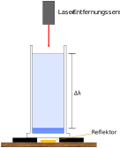

<!--
author:   Herbert Schletter

email:    herbert.schletter@physik.tu-chemnitz.de

version:  0.0.1

language: de

narrator: Deutsch Male

comment:  Ergänzendes Lehrmaterial zu den Vorlesungsversuchen Experimentalphysik
          an der TU Chemnitz

link:     https://cdn.jsdelivr.net/chartist.js/latest/chartist.min.css

script:   https://cdn.jsdelivr.net/chartist.js/latest/chartist.min.js

-->

# Vorlesungsexperimente für die Experimentalphysik

*In den Vorlesungen des Instituts für Physik der TU Chemnitz*

**Dr. Herbert Schletter**

Technische Universität Chemnitz

## Hinweis zum Urheberrecht

Dieses Skriptum steht unter einer  [Creative Commons Namensnennung 4.0 International Lizenz](http://creativecommons.org/licenses/by/4.0/).

Ausgenommen hiervon sind Inhalte (insbesondere Abbildungen), die aus externen
Quellen übernommen wurden und dort unter einer anderslautenden Lizenz
veröffentlicht wurden. Derartige Inhalte sind im Skript stets mit einem eigenen
Lizenzhinweis versehen, der Vorrang vor der hier genannten Lizenz besitzt.

## Vorwort
Die Physik zielt als Naturwissenschaft darauf ab, die Eigenschaften der uns
umgebenden Dinge (die Physik spricht hier allgemein von Körpern) und deren
gegenseitige Wechselwirkungen zu beschreiben. Zur Erreichung dieses – zweifellos
sehr hoch gesteckten – Ziels haben sich zwei grundlegende Herangehensweisen
herausgebildet: die *Theoretische Physik* und die *Experimentalphysik*. Während
die theoretische Physik sich sehr stark am abstrakten Formalismus der Mathematik
orientiert und neue Erkenntnisse durch analytische oder numerische Berechnungen
gewinnt, bezieht die Experimentalphysik ihre Erkenntnisse aus den präzisen
Messungen und Beobachtungen der namensgebenden Experimente. Beide Disziplinen
der Physik stehen gleichberechtigt nebeneinander, ergänzen sich und bestätigen
sich gegenseitig.

An der Hochschule werden theoretische Physik und Experimentalphysik in jeweils
eigenen Lehrveranstaltungen unterrichtet. Dabei werden nicht nur die Ergebnisse,
sondern auch die Denk- und Arbeitsweisen beider Disziplinen vermittelt. In der
Experimentalphysik werden dafür häufig bereits in der Vorlesung Experimente
vorgeführt, die die zu vermittelnden Sachverhalte qualitativ oder auch
quantitativ zeigen. An vielen Hochschulen verfügen die Fachbereiche Physik daher
über einen Vorlesungsassistenten, dessen Aufgabe in der Vorbereitung (und
teilweise auch der Vorführung) der Vorlesungsexperimente liegt. Auch der
Autor dieser Versuchsbeschreibungen gehört zu dieser Gruppe.

Natürlich bieten Vorlesungen nur einen begrenzten zeitlichen Rahmen für die
Durchführung von Experimenten. Messergebnisse sind oftmals sehr schnell wieder
„verschwunden“, wenn der Versuch abgeschlossen ist und der Dozent wieder die
Vorlesung übernimmt. Auch bleibt in der Regel nicht die Zeit, um Berechnungen
vorzuführen, die vom Messwert zum eigentlichen Ergebnis führen. Der Verweis auf
die Übung ist an dieser Stelle nur ein schwacher Trost. Manche Versuche mit
großem „Knalleffekt“ bleiben den Studenten sicherlich eine Zeit lang im
Gedächtnis. Jedoch ist es keine Effekthascherei, auf die die
Vorlesungsexperimente abzielen und die meisten Versuche müssen ohne den
„großen Knall“ auskommen.

Die vorliegende Sammlung von Versuchsbeschreibungen soll bei der Sicherung der
Erkenntnisse aus den Vorlesungsexperimenten helfen. Neben der Beschreibung der
grundlegenden Fragestellung und der Durchführung bestimmter
Vorlesungsexperimente werden auch quantitative Ergebnisse einzelner
Durchführungen aufgenommen und die entsprechenden Auswertungen durchgeführt.

Der größte Teil der Vorlesungsexperimente entfällt auf die Bereiche der
klassischen Physik: Mechanik, Wärmelehre, Elektrizitätslehre, Optik. Für die
Gebiete der modernen Physik (Quantenphysik, Atomphysik, Festkörperphysik, …)
lassen sich nur wenige Experimente im Hörsaalmaßstab realisieren.

## Optik

: [Alchemist-hp](https://commons.wikimedia.org/wiki/User:Alchemist-hp) ([www.pse-mendelejew.de](http://www.pse-mendelejew.de)) + [Richard Bartz](https://commons.wikimedia.org/wiki/User:Richard_Bartz); derivative work: [Matthias M.](https://commons.wikimedia.org/wiki/User:Matthias_M.), [Bi-crystal-white-background](https://commons.wikimedia.org/wiki/File:Bi-crystal-white-background.jpg), [CC BY-SA 3.0](https://creativecommons.org/licenses/by-sa/3.0/legalcode) via Wikimedia Commons]")

### Bestimmung des Brechungsindexes
Die Phasengeschwindigkeit, mit der sich das Licht ausbreitet, ist abhängig vom
Medium, in dem diese Ausbreitung stattfindet. Im Vakuum beträgt sie

$$c_0 = 2{,}99792458\cdot 10^8~\frac{\mathrm m}{\mathrm s} \, ,$$

was allgemein als Lichtgeschwindigkeit, exakter als Vakuum-Lichtgeschwindigkeit
bezeichnet wird. In jedem stofflichen Medium ist die
Ausbreitungsgeschwindigkeit des Lichts kleiner, was durch den Brechungsindex
$n_\mathrm M$ dieses Mediums ausgedrückt wird:

$$c_\mathrm M = \frac{c_0}{n_\mathrm M} \lt c_0 \, .$$

Für das Vakuum (und in sehr guter Näherung auch für Luft) gilt
$n_\mathrm{Luft} \approx n_\mathrm{Vakuum} = 1 \, .$ Alle anderen Medien
besitzen Brechungsindizes $n_\mathrm M \gt 1$.

Zur experimentellen Bestimmung des Brechungsindexes eines Mediums ist folglich
die Lichtgeschwindigkeit in diesem Medium beziehungsweise die Abweichung von der
Vakuum-Lichtgeschwindigkeit zu bestimmen. In der Vorlesung wird dies für das
Ausbreitungsmedium Wasser durchgeführt.

#### Durchführung
Um die Ausbreitungsgeschwindigkeit des Lichts zu bestimmen, muss dessen Laufzeit
für eine vorgegebene Strecke gemessen werden. Für die Messung wird das
CASSY-System der Firma LD Didactic mit einem Laser-Entfernungsmesser verwendet.
Dieses Gerät sendet einen modulierten Laserstrahl aus, der am angepeilten Objekt
reflektiert wird und zurück in den Entfernungsmesser gelangt. Aus der
Phasenverschiebung der Modulation zwischen ausgesendeter und reflektierter
Welle ermittelt das Messgerät die Laufzeit des Lichts und hieraus die Entfernung
des angepeilten Objekts. In der CASSY-Software kann zwischen Laufzeit und
Entfernung als Messgröße gewählt werden. Für den vorliegenden Versuch wurde
erstere aufgezeichnet.

Dieser Entfernungsmesser befindet sich über einem hohen Standzylinder aus Glas.
Anfangs ist dessen Boden nur einige Zentimeter hoch mit Wasser bedeckt. Später
wird weiteres Wasser aus einem höher positionierten Behälter über einen seitlich
angebrachten Stutzen zufließen.
Dieser Stutzen befindet sich dicht über dem Boden des Zylinders liegt bereits zu
Beginn vollständig unter Wasser. Auf diese Weise werden Wellenbewegungen durch
zuströmendes Wasser vermieden, die sonst die Laufzeitmessung des Lichts stören
würden. Unter dem Standzylinder befindet sich eine Reflektorscheibe, auf die
der Laserstrahl des Entfernungsmessers gerichtet ist.

<!-- style="width:8cm;" -->

In dieser Konfiguration wird die Aufzeichnung der Messwerte gestartet. Die
Laufzeit des Lichts ist erwartungsgemäß konstant. Wenn der Wasserzufluss
geöffnet wird, steigt der Wasserspiegel im Standzylinder an und die gemessene
Laufzeit des Lichts vergößert sich kontinuierlich. Dieser Anstieg der Laufzeit
ist der direkte Nachweis der verringerten Lichtgeschwindigkeit im Wasser (im
Vergleich zur Luft).

 im zeitlichen Verlauf der Befüllung des Standzylinders. Die vereinzelten starken Schwankungen des Messwerts entstanden durch Streueffekte an Luftblasen oder Wellen.")

Nachdem der Wasserspiegel um eine definierte Höhe $\Delta h$ angestiegen ist,
wird die Wasserzufuhr gestoppt. Die Laufzeit des Lichts ist nun wieder konstant.
Anschließend wird auch die Messwertaufzeichung beendet. Die Laufzeiten des
Lichts vor Beginn der Befüllung ($t_1$) sowie nach dem Ende der Befüllung
($t_2$) werden jeweils als Mittelwert aus den konstanten Abschnitten der
Messkurve bestimmt. Daraus und aus der Höhe $\Delta h$ kann der Brechungsindex
des Wassers bestimmt werden.

#### Auswertung
Der Laserstrahl verläuft vom Entfernungsmesser ausgehend durch Luft, Wasser,
Glas (Boden des Standzylinders) und Luft bis zur Reflektorscheibe und durch
dieselben Medien zurück in den Sensor. Dieser Laufweg des Lichts lässt sich in
zwei Anteile aufspalten:

1.  $s_\mathrm W=2\Delta h$: Die Strecke, um die der Wasserspiegel steigt. Zu
    Beginn legt das Licht diesen Weg durch Luft zurück, am Ende des Experiments
    durch Wasser. Da das Licht den Standzylinder zweimal passiert (Hin- und
    Rückweg) ist die Höhendiffernz doppelt zu berücksichtigen.

2.  $s_\mathrm R$: Die gesamte restliche Strecke durch Glas, Luft und die
    Anfangsmenge an Wasser. Für diese Strecke tritt keine Veränderung ein.

Der gesamte zurückgelegte Weg ist dann $s_\mathrm{ges}=s_\mathrm W + s_\mathrm R$.

Die Laufzeit des Lichts lässt sich in analoger Weise in die beiden Anteile
$t_\mathrm W$ und $t_\mathrm R$ aufteilen:
$t_\mathrm{ges}=t_\mathrm W +t_\mathrm R$.

Zu Beginn des Experiments:

$$t_1= t_\mathrm{W(Luft)}+t_\mathrm R$$

und am Ende des Experiments:

$$t_2= t_\mathrm{W(Wasser)}+t_\mathrm R$$

Für die Zeitdifferenz

$$\begin{aligned}
t_2-t_1 & = t_\mathrm{W(Wasser)}+t_\mathrm R-(t_\mathrm{W(Luft)}+t_\mathrm R) \\
& =t_\mathrm{W(Wasser)}- t_\mathrm{W(Luft)}
\end{aligned}$$

ist dabei nur die Teilstrecke $s_\mathrm W$ relevant. Für deren zugehörige
Laufzeit gilt am Anfang des Experiments:

$$t_\mathrm{W(Luft)}=\frac{s_\mathrm W}{c_0} \, ,$$

wobei für die Ausbreitungsgeschwindigkeit in Luft die Vakuumlichtgeschwindigkeit
angesetzt wurde ($n_\mathrm{Luft} =1$). Am Ende des Experiments gilt:

$$t_\mathrm{W(Wasser)}=\frac{s_\mathrm W}{c_\mathrm W}=\frac{s_\mathrm W}{c_0}n_\mathrm W$$

Einsetzen in die Formel für die Zeitdifferenz:

$$\begin{aligned}
t_2 - t_1 & =\frac{s_\mathrm W}{c_0}n_\mathrm W - \frac{s_\mathrm W}{c_0} \\
& = \frac{s_\mathrm W}{c_0}\left( n_\mathrm W -1 \right) \\
& = \frac{2\Delta h}{c_0}\left( n_\mathrm W -1 \right)
\end{aligned}$$

Umstellen liefert die Formel für die Brechzahl:

$$n_\mathrm W = 1+\frac{c_0}{2\Delta h}\left(t_2 - t_1 \right)$$

#### Ergebnisse vom 11.06.2021
In der Vorlesung „Elektrodynamik – Optik / Grundlagen der experimentellen Physik
II“ am 11.06.2021 wurden folgende Werte für diesen Versuch bestimmt:

* $t_1 = 5{,}248~\mathrm{ns}$
* $t_2 = 5{,}961~\mathrm{ns}$
* $\Delta h = 30~\mathrm{cm}$

Daraus ergibt sich ein Brechungsindex von $n_\mathrm W = 1{,}36$.

### Einzelphotoneninterferenz

Das Licht ist ein Quantenphänomen, das die Eigenschaften einer Welle und eines
Teilchens in sich vereint. Klassisch schließen sich Wellen- und
Teilchencharakter gegenseitig aus. Der Welle-Teilchen-Dualismus, wie ihn die
Quantenoptik kennt, ist mit der klassischen Physik nicht vereinbar.
Aus diesem Grund entzieht sich auch das Licht in seiner Gesamtheit unserer
Vorstellung.

Ungeachtet dessen lässt sich das Licht durch Anwendung des Wellen- oder
Teilchenmodells physikalisch sehr genau beschreiben. Die Frage, welches dieser
Modell anzuwenden ist, wird beantwortet durch den Charakter, den das Licht in
dem zu beschreibenden Sachverhalt zeigt. Eine scharfe Trennung zwischen
Welleneigenschaften (verkörpert eben durch eine Lichtwelle) und
Teilcheneigenschaften (verkörpert durch das Photon) ist dabei nicht möglich.
Auch das einzelne Photon trägt den vollständigen Wellencharakter des Lichts in
sich. Verdeutlicht wird dies im Vorlesungsexperiment durch den Nachweis der
Interferenz einzelnen Photonen.

#### Durchführung
Voraussetzung für diesen Versuch ist, dass überhaupt einzelne Photonen
detektiert werden können. Dies geschieht mittels
Sekundärelektronenvervielfachers (englisch: photo multiplier), der aus einem
auftreffenden Photon einen messbaren Spannungspuls generiert.

Ferner müssen in der Apparatur einzelne Photonen erzeugt werden.
Grundsätzlich emittiert jede Lichtquelle eine Abfolge einzelner Photonen. Bei
hohen Lichtintensitäten kann dieser Photonenstrom als kontinuierlich angesehen
werden. Durch Verringerung der Intensität wird der (mittlere) zeitliche Abstand
zwischen zwei aufeinanderfolgenden Photonen vergrößert. Folglich kann eine
gewöhnliche Lichtquelle mit sehr geringer Intensität als Einzelphotonenquelle
aufgefasst werden. In der vorliegenden Apparatur beträgt der Lichtweg von der
Quelle bis zum Detektor $~\approx 1~\mathrm m$. Ein Photon legt diese Strecke in
$\approx 3~\mathrm{ns}$ zurück. Ist die mittlere Wartezeit zwischen zwei
emittierten Photonen groß im Vergleich zu dieser Laufzeit, kann davon
ausgegangen werden, dass sich stets höchstens ein Photon in der Anlage befindet.

Im Experiment wird die hierfür benötigte geringe Lichtintensität durch eine
Glühlampe erreicht, die mit sehr geringer Spannung betrieben wird. Das Licht
passiert anschließend einen monochromatischen Grünfilter, der die Intensität
nochmals reduziert. Außerdem ist die Beschränkung auf eine einzelne Wellenlänge
Voraussetzung für die Beobachtung des Interferenzmusters.

Das so erzeugte und gefilterte Licht trifft anschließend auf einen Doppelspalt.
Hinter diesem befindet sich eine Blende als „Spaltblocker“, mit der – je nach
Position – einer der beiden Spalte abgedeckt werden kann. Am „hinteren“ Ende der
Apparatur befindet sich schließlich der oben bereits beschriebene Detektor.
Davor ist eine verschiebbare Spaltblende angeordnet, mit deren Hilfe die Position
ausgewählt wird, an der die auftreffende Photonenzahl (=Lichtintensität)
gemessen werden soll.

Im Vorlesungsversuch wird nur an zwei im Vorfeld bestimmten Detektorpositionen
gemessen, um den zeitlich Rahmen innerhalb der Vorlesung nicht zu sprengen. Für
jede Detektorposition werden drei Messungen mit unterschiedlichen Einstellungen
des Spaltblockers vorgenommen:

1. Nur der linke Spalt ist freigegeben, der rechte Spalt ist verdeckt.
2. Beide Spalte sind freigegeben.
3. Nur der rechte Spalt ist freigegeben, der linke Spalt ist verdeckt.

Bei jeder Messung wird über eine Zeit von 10 Sekunden die Anzahl der ankommenden
Photonen registriert. Für die Messungen muss die gesamte Apparatur lichtdicht
verschlossen sein, da jegliches Streulicht auf dem Detektor die zu messende
Intensität übersteigen würde.

#### Ergebnisse vom 27.01.2020
In der Vorlesung „Physik (mit Experimenten)“ am 27. Januar 2020 wurden folgende
Photonenzahlen registriert:

*  Detektorposition I

| offene Spalte | registrierte Photonen |
| ------------- | ---------------------:|
| links         | 275                   |
| beide         | 983                   |
| rechts        | 203                   |

*  Detektorposition II

| offene Spalte | registrierte Photonen |
| ------------- | ---------------------:|
| links         | 343                   |
| beide         | 48                    |
| rechts        | 202                   |

#### Diskussion
Die Messergebnisse zeigen ein grundlegend unterschiedliches Verhalten an den
beiden Detektorpositionen:
*  In Position I führt die Überlagerung des Signals beider Spalte zu einer
   Verstärkung des Photonenzählrate die deutlich über die Summe der Zählraten
   beider Einzelspalte hinausgeht.
*  In Position II hingegen resultiert die Öffnung beider Spalte zu Verrringerung
   der Zählrate im Vergleich zu den Einzelspalten.

Beide Erscheinungen lassen sich nur durch Interferenz erklären, die im
Maximum (Position I) zur Verstärkung, im Minimum (Position II) hingegen zu einer
(nahezu vollständigen) Auslöschung führt. Da sich entsprechend der anfänglichen
Ausführungen stets höchstens ein Photon in der Apparatur befindet, kann dieser
Effekt nicht durch die Überlagerung mehrerer Photonen erklärt werden. Vielmehr
interferiert das einzelne Photon mit sich selbst. Es folgt daraus, dass auch
das oft als „Teilchen“ aufgefasste Photon den vollständigen Wellencharakter in
sich trägt.
